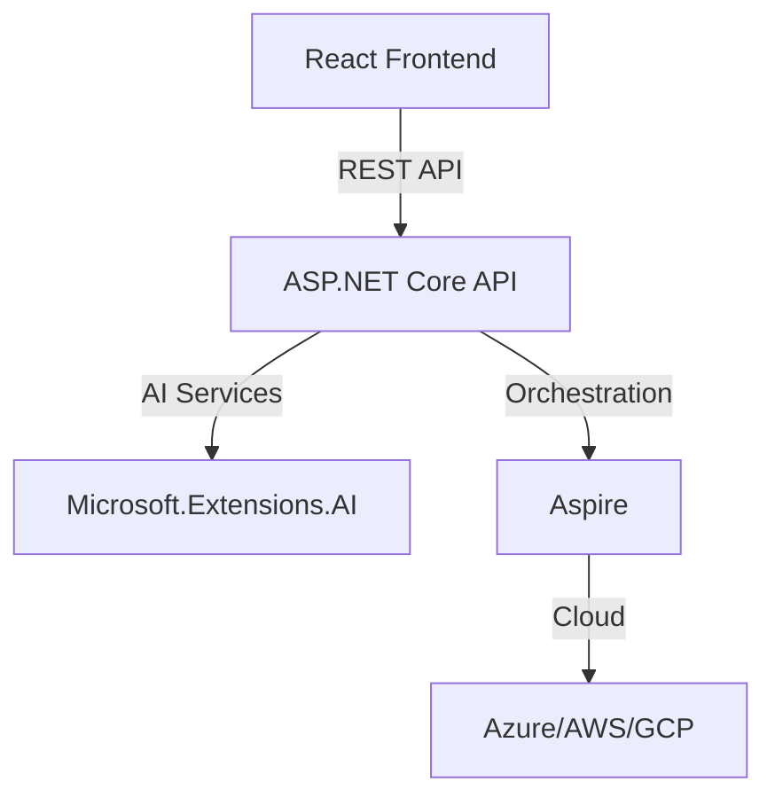

# Project Two: Modern Web App with ASP.NET Core, Aspire, React, and Microsoft.Extensions.AI

Welcome to **Project Two**! This page showcases a sample technology project that leverages a modern .NET stack with AI integration.

---

## Overview

Project Two is a web application built with:

- **ASP.NET Core**: Backend REST API
- **Aspire**: .NET orchestration and cloud-native patterns
- **React**: Interactive frontend UI
- **Microsoft.Extensions.AI**: AI-powered features and services

---

## Features

- User authentication and profile management
- Real-time chat with AI-powered suggestions
- Dashboard with data visualizations
- Cloud-native deployment using Aspire

---

## Architecture



---

## Key Technologies

| Technology                | Purpose                                  |
|---------------------------|------------------------------------------|
| ASP.NET Core              | Backend API and business logic           |
| Aspire                    | Orchestration, cloud-native patterns     |
| React                     | Frontend SPA                             |
| Microsoft.Extensions.AI   | AI integration (e.g., chat, analytics)   |

---

## Example: AI-Powered Chat Endpoint

**ASP.NET Core Controller:**

```csharp
[ApiController]
[Route("api/chat")]
public class ChatController : ControllerBase
{
    private readonly IChatAIService _chatAIService;

    public ChatController(IChatAIService chatAIService)
    {
        _chatAIService = chatAIService;
    }

    [HttpPost]
    public async Task<IActionResult> Post([FromBody] ChatRequest request)
    {
        var response = await _chatAIService.GetResponseAsync(request.Message);
        return Ok(new { reply = response });
    }
}
```

---

## Running Locally

1. **Clone the repo**  
   ```sh
   git clone https://github.com/your-org/project-two.git
   cd project-two
   ```

2. **Start Aspire orchestration**  
   ```sh
   dotnet aspire run
   ```

3. **Start the React frontend**  
   ```sh
   cd frontend
   npm install
   npm start
   ```

4. **Open the app**  
   ```sh
   $BROWSER http://localhost:3000
   ```
